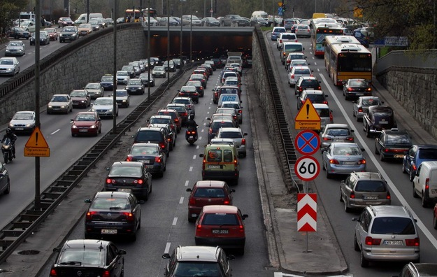
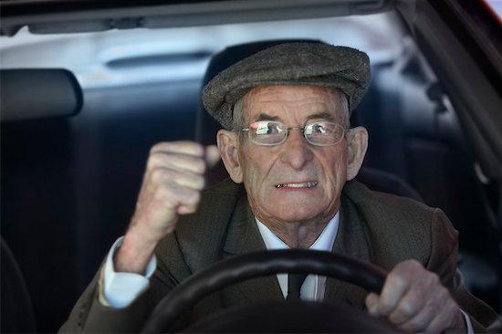
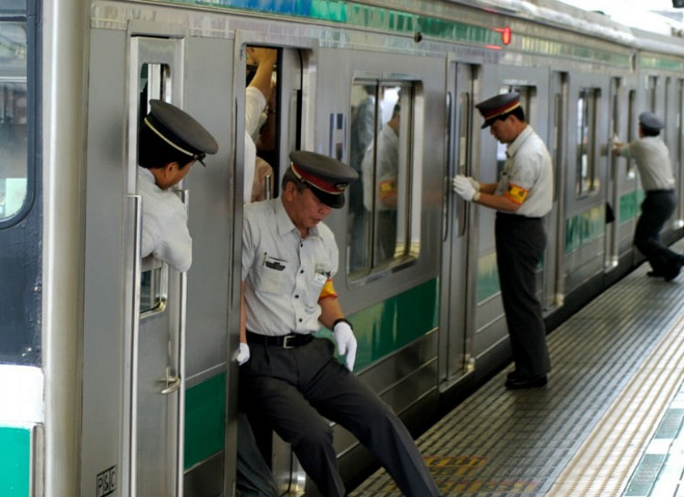
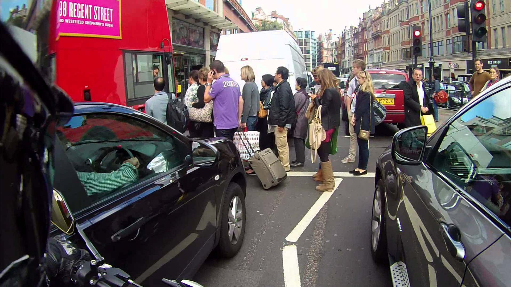
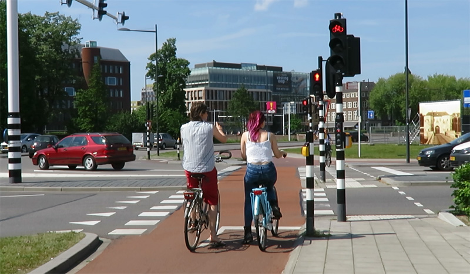

= KRIS
Komunikacji Regulacji Inteligentny System
:doctype: article
:reproducible:
:title-logo-image: 
:source-highlighter: rouge
:listing-caption: Listing
:icons: font
:numbered:
:sectnumlevels: 5
:toc:
:toclevels: 4

=== Wstęp
Prezentowany dokument jest produktem projektu _KRIS_.
Kolejne rozdziały przedstawiają składowe całego systemu.

NOTE: Należy mieć na uwadze, że dokument ten jest dziełem wielu osób, którym na sercu leży poprawa komunikacji miejskiej m. st. Warszawy.

===== Aktualny stan komunikacji miejskiej (publicznej i prywatnej) w Warszawie z punktu widzenia użytkownika
include::parts_of_document/introduction/causes_of_public_and_private_transport.adoc[]

=== Problemy różnych grup społecznych
==== Problemy dotyczące kierowców samochodów
// KRIS-1; KRIS-4; KRIS-5; KRIS-6; KRIS-9; KRIS-12

include::parts_of_document/car_drivers/causes_of_traffic_jams.adoc[]

include::parts_of_document/car_drivers/selected_significant_causes_of_traffic_jams.adoc[]

include::parts_of_document/car_drivers/causes_of_blocking_crossings_by_cars.adoc[]

include::parts_of_document/car_drivers/main_causes_of_blocking_crossings_by_cars.adoc[]

==== Problemy dotyczące pasażerów komunikacji
// KRIS-2; KRIS-3; KRIS-8; KRIS-11

include::parts_of_document/passengers/causes_of_bus_lane_blockage_for_523.adoc[]

include::parts_of_document/passengers/main_causes_of_bus_lane_blocking_for_523.adoc[]

==== Problemy dotyczące pieszych
// KRIS-7;

include::parts_of_document/pedestrians/causes_of_short_green_fear.adoc[]

include::parts_of_document/pedestrians/main_causes_of_short_green_fear.adoc[]

==== Problemy dotyczące rowerzystów
// KRIS-10

include::parts_of_document/cyclists/significant_causes_of_fear.adoc[]

include::parts_of_document/cyclists/selected_significant_causes_of_fear.adoc[]

=== Proponowane rozwiązania
==== Rozwiązania dotyczące kierowców samochodów
// KRIS-1; KRIS-4; KRIS-5; KRIS-6; KRIS-9; KRIS-12
include::parts_of_document/car_drivers/solution_to_the_problem_of_non_existing_tunnels.adoc[]

include::parts_of_document/car_drivers/alternative_solution_instead_of_waiting_for_the_train_to_pass.adoc[]

include::parts_of_document/car_drivers/solution_to_the_problem_of_poor_visibility.adoc[]

include::parts_of_document/car_drivers/solution_to_too_fast_change_of_green_light_to_red.adoc[]

==== Rozwiązania dotyczące pasażerów komunikacji
// KRIS-2; KRIS-3; KRIS-8; KRIS-11
include::parts_of_document/passengers/solution_to_unauthorized_bus_lane_usage.adoc[]

include::parts_of_document/passengers/solution_to_discontinuity_of_bus_lanes.adoc[]

==== Rozwiązania dotyczące pieszych
// KRIS-7;
include::parts_of_document/pedestrians/solution_to_fear_of_too_short_green_light.adoc[]

include::parts_of_document/pedestrians/solution_to_passing_2_times.adoc[]

include::parts_of_document/pedestrians/solution_to_fear_of_missing_bus_by_an_inch.adoc[]

==== Rozwiązania dotyczące rowerzystów
// KRIS-10
include::parts_of_document/cyclists/solution_to_the_problem_of_fear_of_cars.adoc[]

include::parts_of_document/cyclists/solution_to_the_problem_of_fear_other_cyclists.adoc[]

=== Ocena zaproponowanych rozwiązań
==== Ocena rozwiązań dotyczących kierowców samochodów
// KRIS-1; KRIS-4; KRIS-5; KRIS-6; KRIS-9; KRIS-12
include::parts_of_document/car_drivers/evaluation_of_solutions.adoc[]

==== Ocena rozwiązań dotyczących pasażerów komunikacji
// KRIS-2; KRIS-3; KRIS-8; KRIS-11
TODO

==== Ocena rozwiązań dotyczących pieszych
// KRIS-7;
include::parts_of_document/pedestrians/evaluation_of_solutions.adoc[]

==== Ocena rozwiązań dotyczących rowerzystów
// KRIS-10
include::parts_of_document/cyclists/assessment_of_solutions.adoc[]
